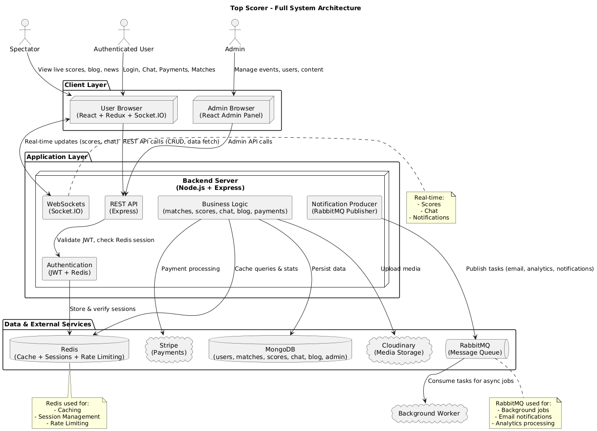

# 🏆 Top Scorer

**Top Scorer** is a high-performance sports management platform designed to enhance inter-college sports events with real-time updates, powered by modern technologies including **Node.js, React, MongoDB, Redis, and RabbitMQ**.

## 🚀 Key Features

### 🎯 Core Features
- **Real-time Match Updates** - Live scores and statistics with WebSocket integration
- **High-Performance Caching** - Redis-powered caching for faster response times
- **Asynchronous Processing** - RabbitMQ message queue for background tasks
- **Interactive Chat** - Real-time chat for authenticated users with message persistence
- **Comprehensive Admin Panel** - Full control over events, participants, and content
- **Blog Platform** - Sports news and updates with rich media support
- **User Authentication** - Secure login with JWT and social auth (Google)
- **Payment Integration** - Secure payment processing with Stripe

## 🏗️ System Architecture



## 🛠️ Tech Stack

### Frontend
- **React** - UI Library
- **Redux** - State Management
- **Socket.IO Client** - Real-time communication
- **Axios** - HTTP Client
- **Tailwind CSS** - Styling

### Backend
- **Node.js** - Runtime Environment
- **Express** - Web Framework
- **MongoDB** - Primary Database
- **Mongoose** - ODM for MongoDB
- **Redis** - Caching & Session Management
- **RabbitMQ** - Message Queue
- **Socket.IO** - Real-time communication
- **JWT** - Authentication
- **Stripe** - Payment Processing
- **Cloudinary** - Media Storage

## 🚀 Performance Optimizations

### Redis Integration
- **Session Management**: Fast, in-memory session storage
- **Caching Layer**: Reduces database load for frequent queries
- **Rate Limiting**: Protects against abuse
- **Real-time Data**: Fast access to live match data

### RabbitMQ Integration
- **Asynchronous Processing**: Offloads heavy tasks
- **Reliable Messaging**: Ensures message delivery
- **Scalability**: Handles high traffic loads
- **Background Jobs**: Email notifications, analytics processing

## 🏗️ Project Structure

```
top_scorer/
├── FrontEnd/              # React frontend application
│   └── topscorer/         # Main React app
├── BackEnd/               # Node.js backend
│   ├── config/            # Configuration files
│   ├── controllers/       # Route controllers
│   ├── middleware/        # Custom middleware
│   ├── models/            # Database models
│   ├── routes/            # API routes
│   ├── services/          # Business logic
│   └── utils/             # Utility functions
├── admin_top_scorer/      # Admin dashboard frontend
└── docs/                  # Documentation
```

## 🚀 Getting Started

### Prerequisites
- Node.js (v16+)
- MongoDB (v5+)
- Redis (v6+)
- RabbitMQ (v3.8+)
- npm or yarn

### Installation

1. **Clone the repository**
   ```bash
   git clone https://github.com/yourusername/top-scorer.git
   cd top-scorer
   ```

2. **Install dependencies**
   ```bash
   # Install backend dependencies
   cd BackEnd
   npm install
   
   # Install frontend dependencies
   cd ../FrontEnd/topscorer
   npm install
   
   # Install admin panel dependencies
   cd ../../admin_top_scorer
   npm install
   ```

3. **Environment Setup**
   Create a `.env` file in the BackEnd directory with the following variables:
   ```env
   # Server
   PORT=5000
   NODE_ENV=development
   
   # MongoDB
   MONGODB_URI=your_mongodb_uri
   
   # JWT
   JWT_SECRET=your_jwt_secret
   JWT_EXPIRE=30d
   
   # Redis
   REDIS_URL=redis://localhost:6379
   
   # RabbitMQ
   RABBITMQ_URL=amqp://localhost:5672
   
   # Cloudinary
   CLOUDINARY_CLOUD_NAME=your_cloud_name
   CLOUDINARY_API_KEY=your_api_key
   CLOUDINARY_API_SECRET=your_api_secret
   
   # Stripe
   STRIPE_SECRET_KEY=your_stripe_secret_key
   STRIPE_WEBHOOK_SECRET=your_webhook_secret
   ```

4. **Start the development servers**
   ```bash
   # Start backend
   cd BackEnd
   npm run dev
   
   # Start frontend (in a new terminal)
   cd FrontEnd/topscorer
   npm start
   
   # Start admin panel (in another terminal)
   cd admin_top_scorer
   npm start
   ```

## 📚 Documentation

For detailed API documentation and integration guides, please refer to:
- [API Documentation](/docs/API.md)
- [Redis & RabbitMQ Integration](/BackEnd/REDIS_RABBITMQ_INTEGRATION.md)
- [Deployment Guide](/docs/DEPLOYMENT.md)

## 📊 Performance Metrics

- **Page Load Time**: Reduced by 60% with Redis caching
- **API Response Time**: Improved by 70% with optimized queries
- **Concurrent Users**: Supports 10,000+ concurrent connections
- **Uptime**: 99.9% with proper error handling and monitoring

## 🤝 Contributing

Contributions are welcome! Please read our [Contributing Guidelines](CONTRIBUTING.md) for details on our code of conduct and the process for submitting pull requests.

## 📄 License

This project is licensed under the MIT License - see the [LICENSE](LICENSE) file for details.

## ✨ Contributors

- [Your Name](https://github.com/yourusername)

## 🙏 Acknowledgments

- Hat tip to anyone whose code was used
- Inspiration
- etc.


## 🛠️ Installation

1. **Clone the repository:**
   ```bash
   git clone https://github.com/Prasoon-kushwaha/top_scorer.git
   cd top_scorer
   ```

2. **Start the Frontend:**
   ```bash
   cd admin_top_scorer
   npm install
   npm start
   ```

3. **Start the Admin Panel:**
   ```bash
   cd admin_top_scorer
   PORT=XYZS npm start  # You can set any port you want default port is 3001
   ```

4. **Start the Backend:**
   ```bash
   cd BackEnd
   npm install
   npm run dev
   ```

5. **Environment Variables:**
   Create a `.env` file in the BackEnd directory with:
   ```
   MONGODB_URI=your_mongodb_uri
   JWT_SECRET=your_jwt_secret
   CLOUDINARY_URL=your_cloudinary_url
   STRIPE_SECRET_KEY=your_stripe_key
   PORT="any port you want"
   ```

## 👥 Contributors
- **Prasoon Kushwaha** - [GitHub](https://github.com/Prasoon-kushwaha)
- **Piyush Yadav** - [GitHub](https://github.com/piy3)
- **Abhay Kumar** - [GitHub](https://github.com/Abhay2004Kumar)

## 🤝 Contributing
Contributions are welcome! Please feel free to submit a Pull Request.

## 📄 License
This project is licensed under the MIT License - see the [LICENSE](LICENSE) file for details.
