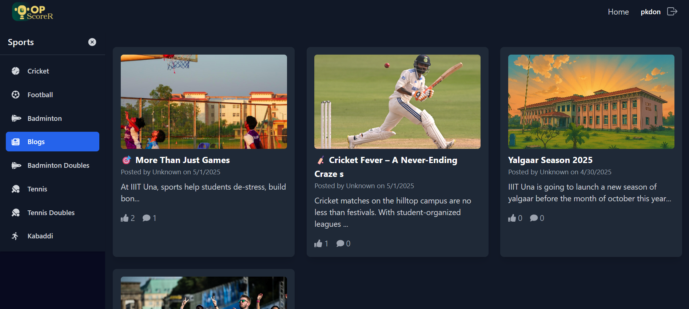

# 🏆 Top Scorer

**Top Scorer** is a comprehensive sports management platform designed to enhance the sports meet experience for inter-college events, such as Inter-IIIT or other sports fests. The website leverages **Socket.IO** to provide real-time updates, improving engagement and accessibility for all users.

## ✨ Key Features

- **Real-time Match Updates** - Live scores and statistics
- **Match Winning Prediction** - AI-powered match predictions
- **Interactive Chat** - Real-time chat for authenticated users
- **Comprehensive Admin Panel** - Full control over events and participants
- **Blog Platform** - Latest sports news and updates

## 🏗️ System Architecture


## 🚀 Features in Detail

### Admin Panel
Manage events, participants, and scores with an intuitive admin interface.


### Live Match Center
Real-time match updates and statistics.


### Blog Platform
Stay updated with the latest sports events and news.


### User Dashboard
Track your favorite teams and players.


## 🛠️ Installation

1. **Clone the repository:**
   ```bash
   git clone https://github.com/Prasoon-kushwaha/top_scorer.git
   cd top_scorer
   ```

2. **Start the Frontend:**
   ```bash
   cd admin_top_scorer
   npm install
   npm start
   ```

3. **Start the Admin Panel:**
   ```bash
   cd admin_top_scorer
   PORT=XYZS npm start  # You can set any port you want default port is 3001
   ```

4. **Start the Backend:**
   ```bash
   cd BackEnd
   npm install
   npm run dev
   ```

5. **Environment Variables:**
   Create a `.env` file in the BackEnd directory with:
   ```
   MONGODB_URI=your_mongodb_uri
   JWT_SECRET=your_jwt_secret
   CLOUDINARY_URL=your_cloudinary_url
   STRIPE_SECRET_KEY=your_stripe_key
   PORT="any port you want"
   ```

## 👥 Contributors
- **Prasoon Kushwaha** - [GitHub](https://github.com/Prasoon-kushwaha)
- **Piyush Yadav** - [GitHub](https://github.com/piy3)
- **Abhay Kumar** - [GitHub](https://github.com/Abhay2004Kumar)

## 🤝 Contributing
Contributions are welcome! Please feel free to submit a Pull Request.

## 📄 License
This project is licensed under the MIT License - see the [LICENSE](LICENSE) file for details.
